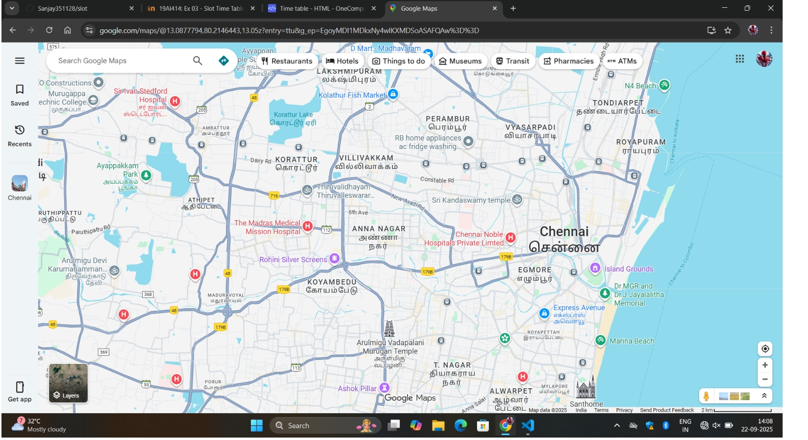
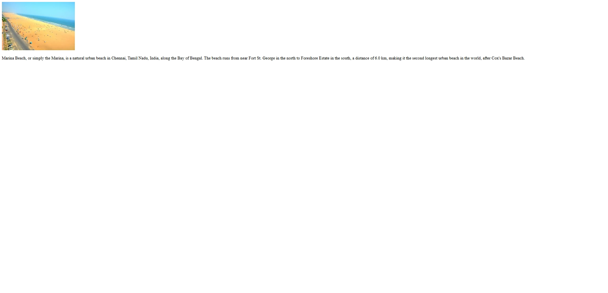
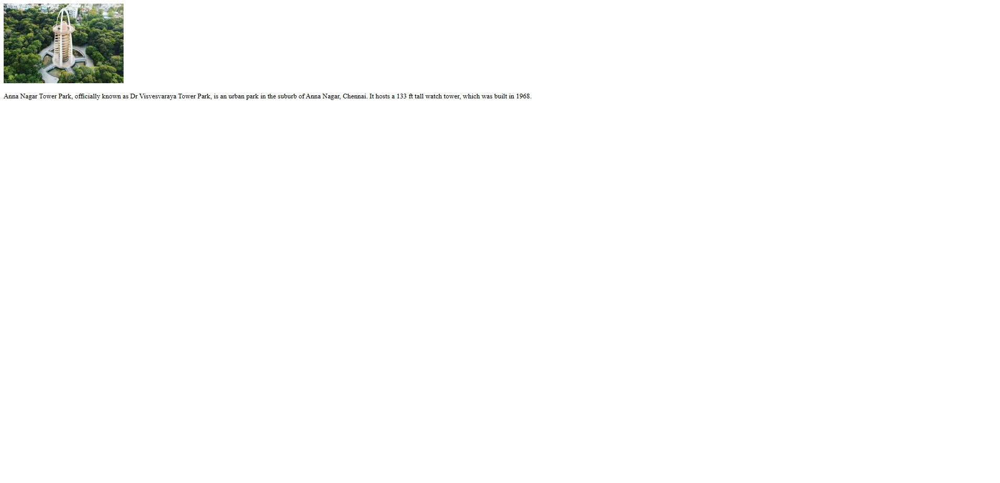

# Ex04 Places Around Me
## Date:07.10.2025
DHARANI.A

## AIM
To develop a website to display details about the places around my house.

## DESIGN STEPS

### STEP 1
Create a Django admin interface.

### STEP 2
Download your city map from Google.

### STEP 3
Using ```<map>``` tag name the map.

### STEP 4
Create clickable regions in the image using ```<area>``` tag.

### STEP 5
Write HTML programs for all the regions identified.

### STEP 6
Execute the programs and publish them.

## CODE
```
beach.html
<!DOCTYPE html>
<html lang="en">
<head>
    <meta charset="UTF-8">
    <meta name="viewport" content="width=device-width, initial-scale=1.0">
    <title>Document</title>
</head>
<body>
    
    <p>Marina Beach, or simply the Marina, is a natural urban beach in Chennai, Tamil Nadu, India, along the Bay of Bengal. The beach runs from near Fort St. George in the north to Foreshore Estate in the south, a distance of 6.0 km, making it the second longest urban beach in the world, after Cox's Bazar Beach.</p>
</body>
</html>
home.html
<!DOCTYPE html>
<html lang="en">
<head>
    <meta charset="UTF-8">
    <meta name="viewport" content="width=device-width, initial-scale=1.0">
    <title>Document</title>
</head>
<body>
    <!-- Image Map Generated by http://www.image-map.net/ -->


<map name="image-map">
    <area target="" alt="marina beach" title="marina beach" href="beach.html" coords="1374,904,1515,794" shape="rect">
    <area target="" alt="anna tower" title="anna tower" href="tower.html" coords="930,589,70" shape="circle">
    <area target="" alt="goverment museum" title="goverment museum" href="museum.html" coords="1264,649,1349,639,1361,694,1308,722,1261,694" shape="poly">
</map>
</body>
</html>
museum.html
<!DOCTYPE html>
<html lang="en">
<head>
    <meta charset="UTF-8">
    <meta name="viewport" content="width=device-width, initial-scale=1.0">
    <title>Document</title>
</head>
<body>
  
  <p>The Government Museum, also known as the Madras Museum, is the second-oldest museum in India, located in Egmore, Chennai, and established in 1851.</p>
</body>
</html>
tower.html
<!DOCTYPE html>
<html lang="en">
<head>
    <meta charset="UTF-8">
    <meta name="viewport" content="width=device-width, initial-scale=1.0">
    <title>Document</title>
</head>
<body>
    
    <P>Anna Nagar Tower Park, officially known as Dr Visvesvaraya Tower Park, is an urban park in the suburb of Anna Nagar, Chennai. It hosts a 133 ft tall watch tower, which was built in 1968.</P>
</body>
</html>
```


## OUTPUT





## RESULT
The program for implementing image maps using HTML is executed successfully.
